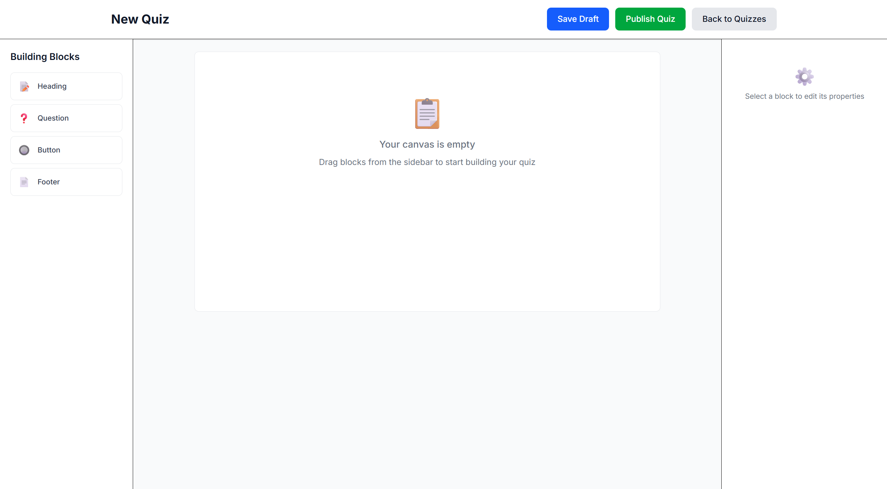
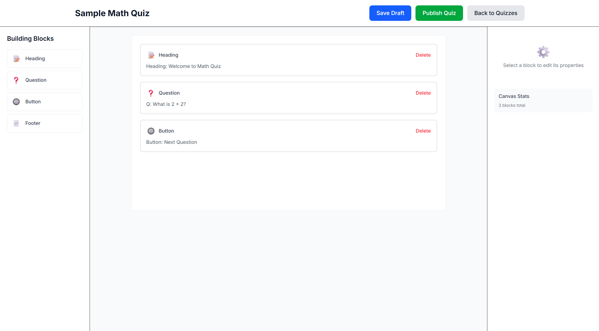
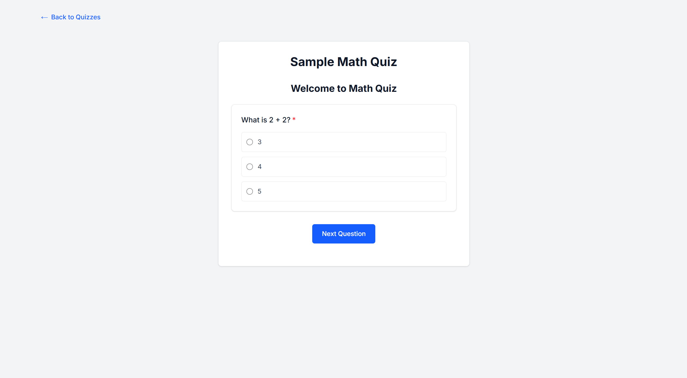
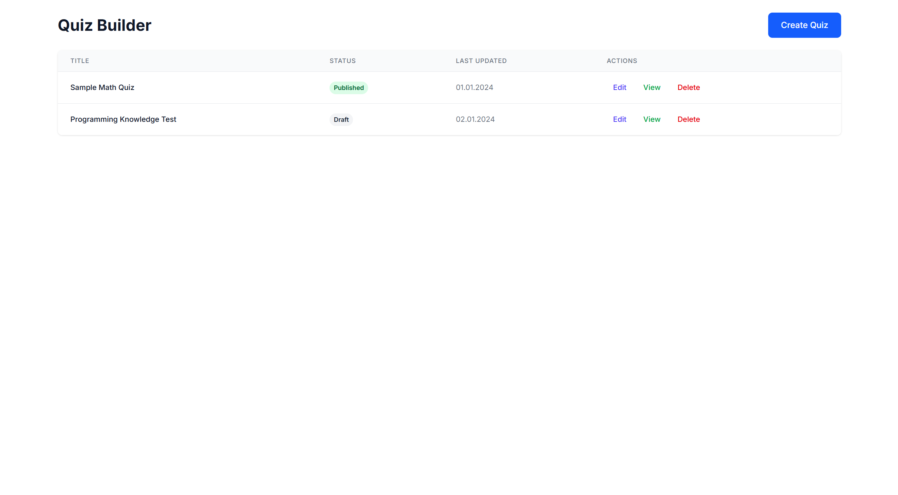

# Quiz Builder

### Project Overview

A drag-and-drop quiz builder that works entirely in the browser. Allows creating, editing, and publishing interactive quizzes without any backend requirements.

## Live Demo
https://quiz-builder-sage.vercel.app/

## Screenshots

<details>
<summary> Create </summary>



</details>

<details>
<summary> Edit </summary>



</details>

<details>
<summary> Publish </summary>



</details>

<details>
<summary> Render </summary>



</details>

## How to Run the Code

#### Prerequisites

* Node.js 18+
* npm, yarn, or pnpm
* Modern browser with localStorage support

### Step 1: Clone the repository
```
# HTTPS
git clone https://github.com/FeodK/quiz-builder.git

# or SSH
git clone git@github.com:FeodK/quiz-builder.git

cd quiz-builder

```

### Step 2: Install Dependencies
``` 
npm install
# or
yarn install
# or
pnpm install 
```

### Step 3: Start Development Server
```
npm run dev
# or
yarn dev
# or
pnpm dev
```

### Step 4: Open in Browser

Navigate to: http://localhost:3000


## Technology Stack & Implementation Rationale

### Chosen Stack:

* Next.js 15 with App Router
* TypeScript
* Tailwind CSS
* React DnD
* localStorage

### Why This Stack?

### Next.js 15 + App Router

**Advantages:**

* Server Components for SEO and performance
* Automatic code splitting
* Built-in routing and optimizations
* Modern React patterns
* Excellent developer experience

**Alternatives Considered:**

* Create React App - outdated, no SSR
* Vite - no built-in SSR and routing
* Remix - good alternative but less popular

### TypeScript 

**Advantages:**

* Type safety and better IntelliSense
* Early error detection
* Self-documenting code
* Better refactoring capabilities

**Alternatives Considered:**

* JavaScript - no type safety, more runtime errors

### Tailwind CSS 

**Advantages:**

* Utility-first approach for rapid development
* No naming conflicts
* Small bundle size
* Consistent design system

**Alternatives Considered:**

* Styled Components - runtime overhead, larger bundle
* CSS Modules - good alternative but less flexible
* Plain CSS - difficult to maintain at scale

### React DnD 

**Advantages:**

* Industry-standard solution
* Excellent documentation
* Touch device support
* Flexible architecture

**Alternatives Considered:**

* dnd-kit - modern alternative
* React Beautiful DnD - deprecated
* Custom solution - difficult to implement correctly

### localStorage

**Advantages:**

* Zero setup required
* Works offline
* Fast development cycle
* No backend dependencies

**Alternatives Considered:**

* IndexedDB - more capabilities but more complex
* Backend API - requires server infrastructure
* Cookies - limited storage capacity

## Architectural Decisions Comparison

### **State Management**

### Chosen: React useState + useContext

* Simplicity
* Small bundle size
* Easy to understand and debug

**Alternatives Considered:**

* Redux - overkill for this scale
* Zustand - good modern alternative
* Jotai - excellent atomic state solution

### **Data Persistence**

### Chosen: localStorage

* Works out of the box
* No backend required
* Simple implementation

**Alternatives Considered:**

* Firebase - good for real applications
* Supabase - excellent open-source alternative
* Custom backend - over-engineering for demo

## Assumptions & Limitations

### Technical Limitations

1. Data Size: localStorage limited to ~5MB
2. No Synchronization: Data exists only in current browser
3. No Offline Persistence: Data lost if localStorage cleared
4. Performance: May slow down with 1000+ quizzes

### Functional Assumptions

1. No User System: All quizzes accessible to everyone
2. No History: Missing undo/redo functionality
3. Basic Validation: Minimal data validation implemented
4. No Export: Cannot download or share quizzes externally

### Security Considerations

1. No Authentication: Anyone can edit any quiz
2. XSS Vulnerabilities: Potential risks from dynamic content
3. No Data Validation: Users can save any data structure

### Browser Limitations

1. Modern Browsers Only: No Internet Explorer support
2. JavaScript Required: Doesn't work with JS disabled
3. LocalStorage Must Be Enabled

## Potential Improvements

### Short-term Enhancements

* Undo/redo functionality
* Enhanced validation system
* Export/import capabilities
* Block duplication feature

### Medium-term Roadmap

* Backend integration
* User authentication system
* Real-time collaboration
* Advanced analytics dashboard

### Long-term Vision

* PWA capabilities
* Offline support
* Plugin system architecture
* Template marketplace

## Known Issues

1. Drag-and-drop Performance: Occasional lag with large quizzes
2. No Optimistic Updates: UI may briefly freeze during operations
3. Limited Error Handling: Some errors not handled gracefully
4. Missing Loading States: Some operations lack visual feedback
5. Application is not usable on screens with resolution less than 768px
